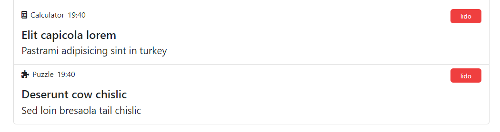
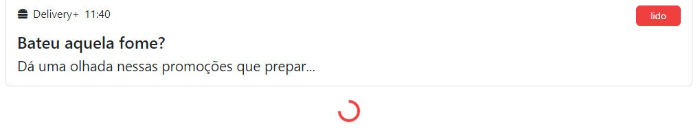
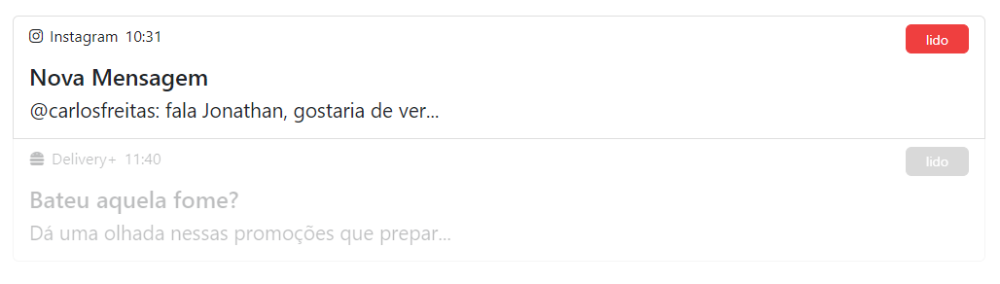

# App de Notificações

Esta aplicação [**Angular**](https://angular.io/) apresenta notificações padrão e permite ao usuário:

- Gerar novas notificações
- Marcar notificações como **lidas**

 

## It's LIVE

Aplicação pode ser acessada [**online**](https://dih-philips-ng-week-exercises.herokuapp.com/m1s10/home).

 

## Gerando notificações

A aplicação gera notificações aleatórias através do botão **Randomize it!** ([componente RandomNotification](https://github.com/jtspinelli/DEVinPhilips_Angular_exercicios-da-semana/blob/master/src/app/M1S08/components/random-notification/random-notification.component.ts)).

As notificações aleatórias:
- Sorteiam ícones e nomes através das classes do [Font Awesome](https://fontawesome.com/)
- Obtem palavras a partir da [JSON API](https://baconipsum.com/json-api/) do site baconipsum.com para compor título e subtítulo das notificações

 

## Classe AppNotification

Cada notificação é uma instância da classe [AppNotification](https://github.com/jtspinelli/DEVinPhilips_Angular_exercicios-da-semana/blob/master/src/app/M1S08/models/AppNotification.ts).

A classe possui uma [variável estática](https://github.com/jtspinelli/DEVinPhilips_Angular_exercicios-da-semana/blob/8072724e77a39dc9d4ec33d3d7a2d61e406448b7/src/app/M1S08/models/AppNotification.ts#L8) que armazena todas as instâncias, para fácil acesso às notificações.

 

## Serviço

Uma [classe de serviço](https://github.com/jtspinelli/DEVinPhilips_Angular_exercicios-da-semana/blob/master/src/app/M1S08/services/loading.service.ts) auxilia a componente RandomNotification a informar à componente [NotificationList](https://github.com/jtspinelli/DEVinPhilips_Angular_exercicios-da-semana/blob/master/src/app/M1S08/components/notification-list/notification-list.component.ts) que nova notificação está sendo gerada.

Este processo permite a exibição do [bootstrap spinner](https://getbootstrap.com/docs/4.2/components/spinners/) precisamente durante a "fabricação" de nova notificação.

 

## Diretiva ngClass

Através da diretiva [ngClass](https://angular.io/api/common/NgClass), uma estilização para **notificação lida** é aplicada à respectiva notificação ao ser clicado no botão **lido**.

